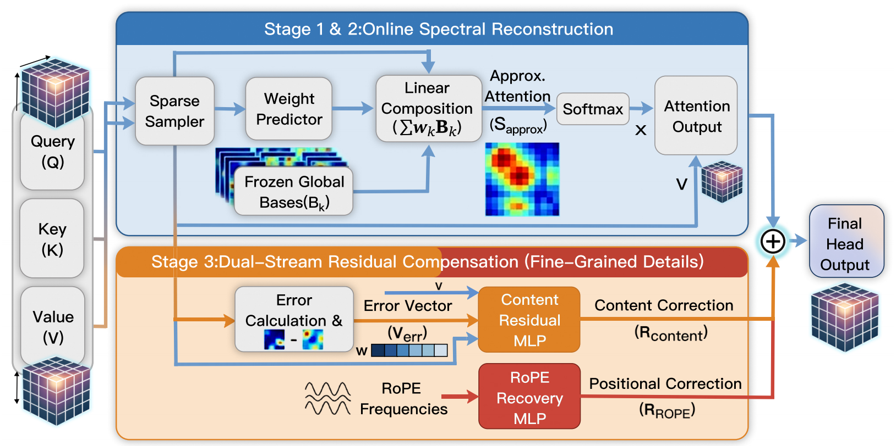

# Video-SVD

Official implementation of:

**Video-SVD: Efficient Video Diffusion via Orthogonal Basis Composition**

[Paper](paper link)

## Overview

Video Diffusion Transformers (VDiTs) achieve impressive video generation quality,
but the quadratic complexity of self-attention limits efficient deployment.

In this work, we reveal that video attention contains substantial low-dimensional
structure and can be represented through a compact set of reusable basis patterns.

Based on these observations, we propose Video-SVD, a training-free framework that
accelerates video diffusion through orthogonal basis composition and structured
residual compensation.

## Method



Video-SVD consists of three components:

- **Offline Basis Learning:** learns checkpoint-adaptive attention bases.
- **Online Weight Estimation:** reconstructs attention through lightweight basis composition.
- **Residual Compensation:** restores fine-grained content and positional information.

## Results

Video-SVD achieves efficient high-quality video generation on
HunyuanVideo and Wan2.1 models while maintaining generation fidelity.

| Model | Speedup |
| --- | --- |
| HunyuanVideo | 1.92× |
| Wan2.1-1.3B | 1.75× |
| Wan2.1-14B | 1.79× |

## Code

Coming soon.

## Citation

If you find this work useful, please cite:

```bibtex
Coming soon
