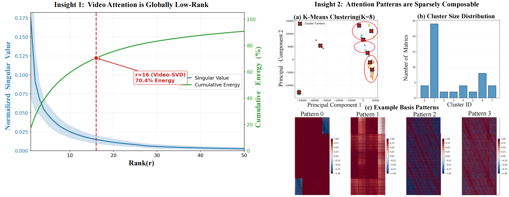
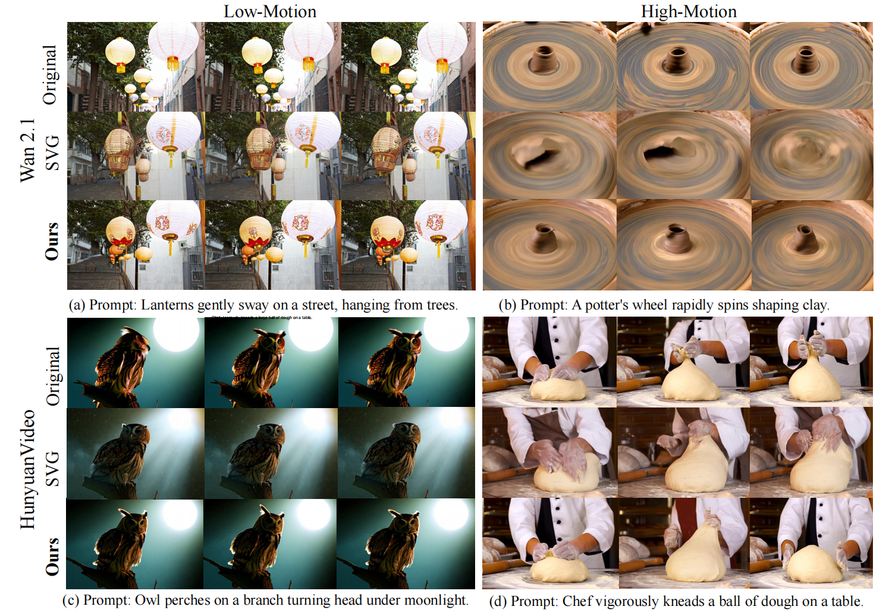

# Video-SVD: Efficient Video Diffusion via Orthogonal Basis Composition

<h2 align="center">🎉 Accepted to ICML 2026 🎉</h2>


## Overview

Video Diffusion Transformers (VDiTs) achieve impressive video generation quality,
but the quadratic complexity of self-attention limits efficient deployment.

In this work, we reveal that video attention exhibits substantial low-dimensional
structure and can be represented through a compact set of reusable basis patterns.

Based on these observations, we propose Video-SVD, a training-free framework that
accelerates video diffusion through orthogonal basis composition and structured
residual compensation.

## Key Insights

Video-SVD is motivated by two observations:

1. **Video Attention Exhibits Effective Low-Dimensional Structure.**  
   Video attention contains substantial redundancy and can be captured by a compact
   set of dominant components.

2. **Attention Patterns are Sparsely Composable.**  
   Complex spatio-temporal attention patterns can be represented as combinations of
   shared structural bases rather than rigid spatial or temporal patterns.




## Method


Video-SVD consists of three components:

- **Offline Basis Learning:** learns checkpoint-adaptive attention bases from
  large-scale video attention patterns.

- **Online Weight Estimation:** reconstructs attention through lightweight basis
  composition without dense attention computation.

- **Residual Compensation:** restores fine-grained content details and positional
  information for high-fidelity generation.


## Results

Video-SVD achieves efficient high-quality video generation on
HunyuanVideo and Wan2.1 models while maintaining generation fidelity.

| Model | Speedup |
| --- | --- |
| HunyuanVideo | 1.92× |
| Wan2.1-1.3B | 1.75× |
| Wan2.1-14B | 1.79× |



## Code

Coming soon.


## Citation

If you find this work useful, please cite:

```bibtex
Coming soon
